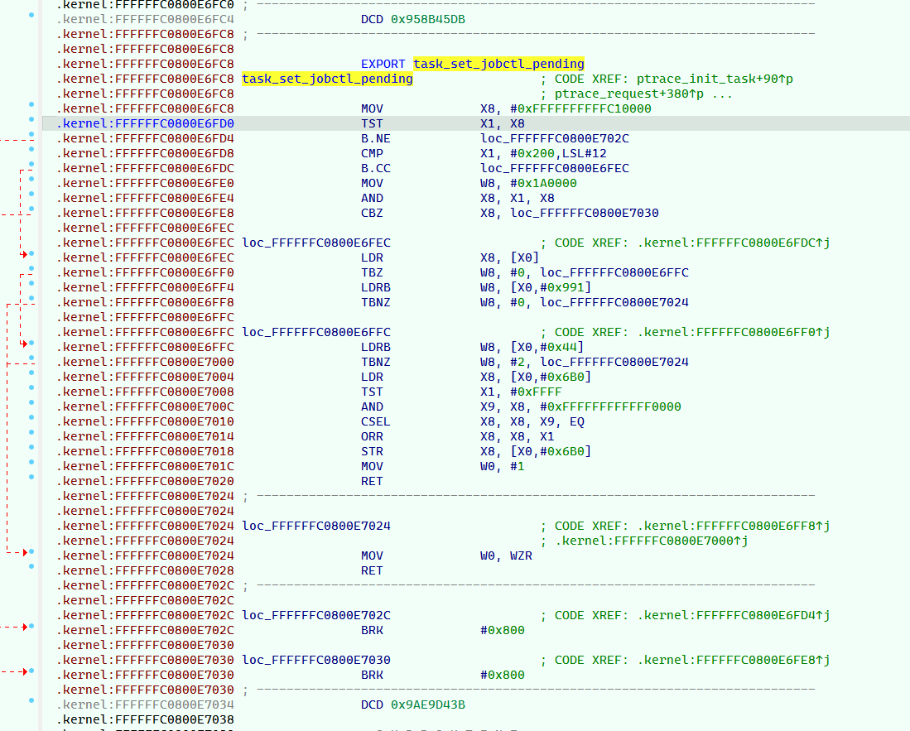
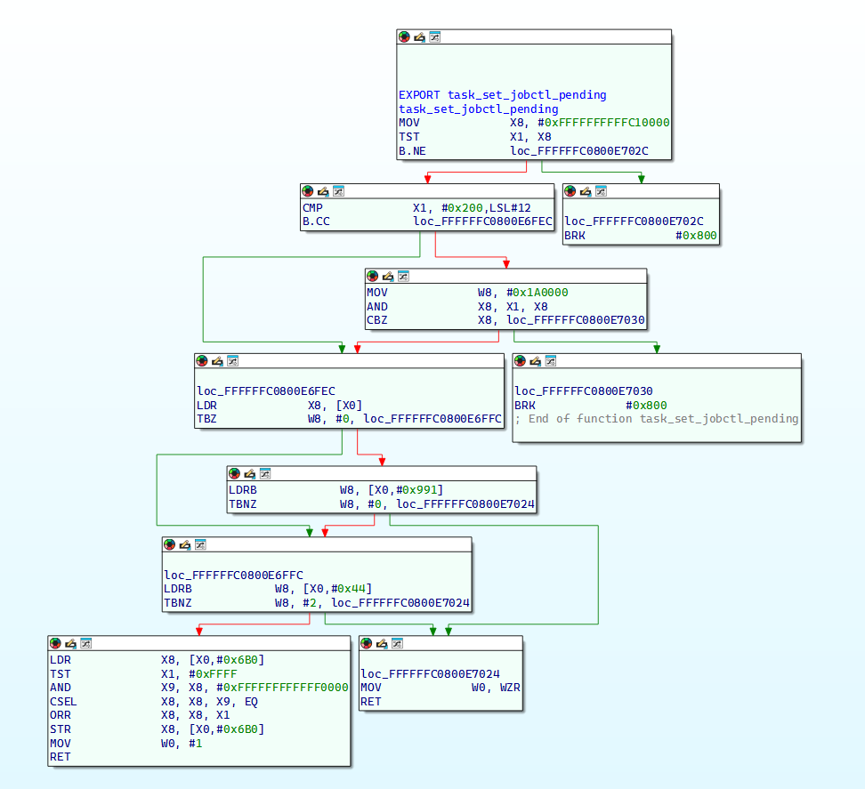
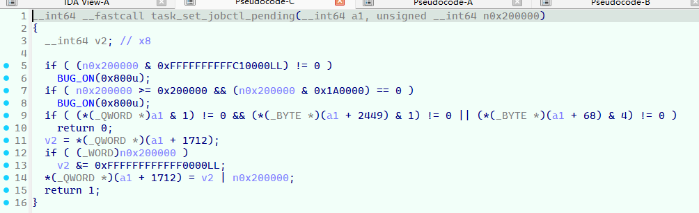
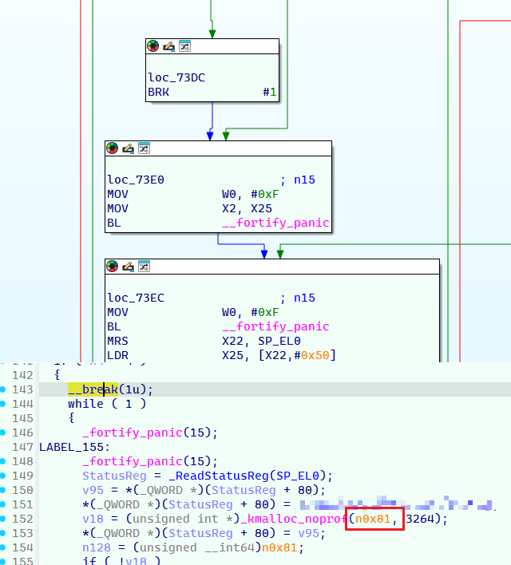
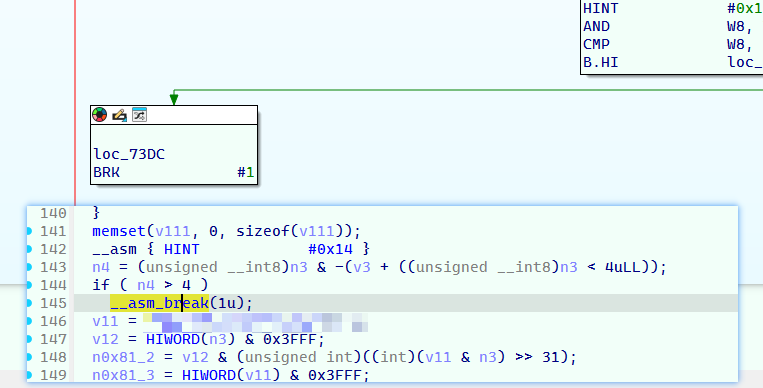

# ida_better_arm64_brk

怎么IDA的brk指令还得自己修啊（恼

⚠️ 没充分测试! (only tested on IDA 9.2)

## case 1

### before



```
.kernel:FFFFFFC0800E7034: The function has undefined instruction/data at the specified address.
Your request has been put in the autoanalysis queue.
```

can't make function, and can't F5

### after





## case 2

### before



## after

